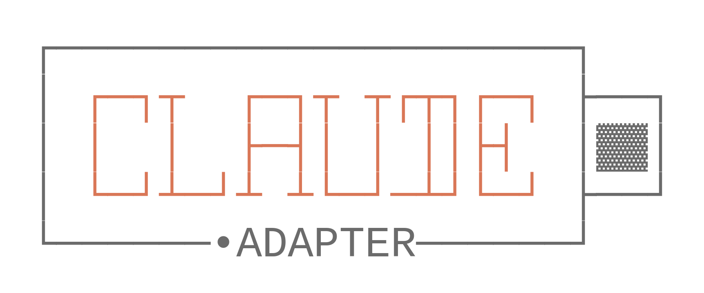

<div align="center">

# claude-responses-adapter



**Bridge Claude-compatible clients to Responses API providers**

[](https://opensource.org/licenses/MIT)
[](https://nodejs.org)

[Overview](#overview) •
[Getting Started](#getting-started) •
[Configuration](#configuration) •
[API Reference](#api-reference) •
[Development](#development)

</div>

---

## Overview

`claude-responses-adapter` is a local proxy that accepts Claude / Anthropic-compatible requests and forwards them to OpenAI-compatible or Responses-style providers.

Its purpose is narrower than the original `claude-adapter` project: this repository is focused on protocol bridging for Claude-compatible clients, especially where request/response shape, streaming, and tool calling need translation before reaching the upstream provider.

### Project origin

This project is based on [shantoislamdev/claude-adapter](https://github.com/shantoislamdev/claude-adapter), but it has since diverged substantially.

- The upstream project provided the original starting point and structure.
- This repository now targets a different operational goal: bridging Claude-compatible clients to Responses API providers.
- Protocol handling, startup UX, and project messaging have diverged enough that this repo should be treated as a separate project.

### How this differs from the upstream project

- **Different purpose** — this repo is positioned as a Responses API bridge, not a generic “adapt any model for Claude Code” layer.
- **Different protocol emphasis** — the implementation is centered on translating Claude-compatible traffic into the upstream provider formats this project needs.
- **Different runtime workflow** — the CLI is optimized around configuring and running a local bridge for Claude-compatible clients.

### Key features

- **Protocol translation** — maps Claude / Anthropic-compatible request structures into upstream provider formats.
- **Streaming support** — preserves server-sent event behavior so Claude-compatible clients can stream responses through the bridge.
- **Tool calling compatibility** — translates tool definitions and tool-use flows across protocol boundaries.
- **Interactive setup** — provides a CLI configuration flow for base URL, API key, and model mapping.
- **Local proxy operation** — runs as a local HTTP bridge without patching the Claude Code binary.

---

## Architecture

The adapter runs as a local HTTP server between a Claude-compatible client and an upstream provider.

```
┌────────────────────┐      ┌──────────────────────────┐      ┌────────────────────────────┐
│ Claude-compatible  │ ───▶ │ claude-responses-adapter │ ───▶ │ Responses / OpenAI-style   │
│ client             │ ◀─── │ protocol bridge          │ ◀─── │ provider endpoint          │
└────────────────────┘      └──────────────────────────┘      └────────────────────────────┘
   Claude/Anthropic            Request + response mapping         Upstream provider protocol
```

When the client sends a Claude-compatible request, `claude-responses-adapter` intercepts it, transforms the payload into the configured upstream format, forwards it to the provider, then converts the response back into the Claude-compatible format expected by the client.

---

## Getting Started

### Prerequisites

- **Node.js**: version 20 or higher
- **API access**: an API key for a supported upstream provider

### Installation

```bash
npm install -g claude-responses-adapter
```

### Quick start

1. Start the interactive setup:
   ```bash
   claude-responses-adapter
   ```

2. Provide the required configuration:
   - **Base URL** for your upstream provider
   - **API key**
   - **Model mapping** for `opus`, `sonnet`, and `haiku`

3. The adapter starts a local bridge server and, unless disabled, updates Claude settings to point to that local endpoint.

---

## Configuration

### CLI options

| Option                 | Description                               | Default |
| ---------------------- | ----------------------------------------- | ------- |
| `-p, --port <port>`    | Port for the local bridge server          | `3080`  |
| `-r, --reconfigure`    | Force the configuration wizard            | `false` |
| `--no-claude-settings` | Skip updating Claude Code settings files  | `false` |
| `-V, --version`        | Show version information                  | —       |
| `-h, --help`           | Show available commands and options       | —       |

### Model mapping

The adapter maps Claude-facing model tiers to upstream models you choose.

| Claude Tier | Typical role        | Example mapping                |
| ----------- | ------------------- | ------------------------------ |
| `opus`      | heavy reasoning     | `gpt-5.2-codex-max`            |
| `sonnet`    | balanced workloads  | `gpt-5.2-codex`                |
| `haiku`     | lower-latency tasks | `gpt-5-mini`                   |

---

## API Reference

### Programmatic integration

The package exports its server factory and conversion helpers:

```typescript
import { createServer, AdapterConfig } from 'claude-responses-adapter';

const config: AdapterConfig = {
  baseUrl: 'https://api.openai.com/v1',
  apiKey: process.env.OPENAI_API_KEY!,
  models: {
    opus: 'gpt-5.2-codex-max',
    sonnet: 'gpt-5.2-codex',
    haiku: 'gpt-5-mini'
  }
};

const server = createServer(config);
await server.start(3080);
```

### Conversion utilities

```typescript
import {
  convertRequestToOpenAI,
  convertResponseToAnthropic
} from 'claude-responses-adapter';

const upstreamRequest = convertRequestToOpenAI(anthropicRequest, 'target-model-name');
const anthropicResponse = convertResponseToAnthropic(upstreamResponse, 'original-model-name');
```

For endpoint-level details, see [docs/API.md](./docs/API.md).

---

## Supported Features

| Feature Capability    | Support Status | Implementation Notes                  |
| --------------------- | :------------: | ------------------------------------- |
| Text generation       |       ✅        | Claude-compatible response mapping    |
| System prompts        |       ✅        | Translated to upstream request format |
| Real-time streaming   |       ✅        | SSE translation                       |
| Tool/function calling |       ✅        | Protocol-aware mapping                |
| Context preservation  |       ✅        | Multi-turn history support            |
| Token controls        |       ✅        | Parameter forwarding                  |
| Stop sequences        |       ✅        | Translated where supported            |
| Multimodal inputs     |       🔜        | Not fully implemented                 |

---

## Troubleshooting

<details>
<summary><strong>EADDRINUSE: Port collision</strong></summary>

If port `3080` is already in use, start the bridge on another port:

```bash
claude-responses-adapter --port 3000
```
</details>

<details>
<summary><strong>Authentication failures</strong></summary>

If the upstream provider returns `401`, rerun the configuration wizard:

```bash
claude-responses-adapter --reconfigure
```
</details>

<details>
<summary><strong>Connection refused</strong></summary>

Make sure the local bridge is running, then verify `ANTHROPIC_BASE_URL` points to the correct local address in `~/.claude/settings.json`.
</details>

<details>
<summary><strong>Manual configuration mode</strong></summary>

To avoid modifying Claude settings automatically:

```bash
claude-responses-adapter --no-claude-settings
```

Then set the required environment variables yourself in `~/.claude/settings.json`:

```json
{
  "env": {
    "ANTHROPIC_BASE_URL": "http://localhost:3080",
    "ANTHROPIC_AUTH_TOKEN": "default"
  }
}
```
</details>

---

## Development

```bash
git clone https://github.com/Killea/claude-responses-adapter.git
cd claude-responses-adapter
npm install
npm run dev
npm test
npm run build
```

See [CONTRIBUTING.md](./CONTRIBUTING.md) for contribution guidelines.

---

## License

This project is licensed under the **MIT License**. See [LICENSE](./LICENSE).

---

<div align="center">

**[Issues](https://github.com/Killea/claude-responses-adapter/issues)** •
**[Documentation](./docs/)** •
**[Upstream project](https://github.com/shantoislamdev/claude-adapter)**

</div>
